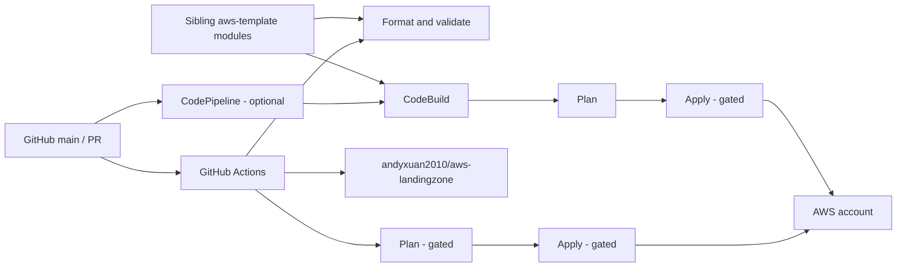

# Architecture

The root composition uses `vpc`, `iam_role`, `kms_key`, and `s3_bucket` from `aws-template`. Pipeline orchestration resources live at the root because they coordinate the repository itself.

## Cost posture

| Capability | Default | Cost posture |
|---|---:|---|
| VPC, subnets, route tables, internet gateway | On | No hourly charge; normal transfer charges can still apply |
| Terraform IAM role | On | No direct IAM charge |
| NAT Gateway | Off | Hourly and data processing charges |
| Customer-managed KMS key | Off | Monthly key and request charges |
| Workload S3 bucket | Off | Storage and request charges |
| CodePipeline, CodeBuild, artifact bucket | Off | Pipeline/build/storage usage charges |
